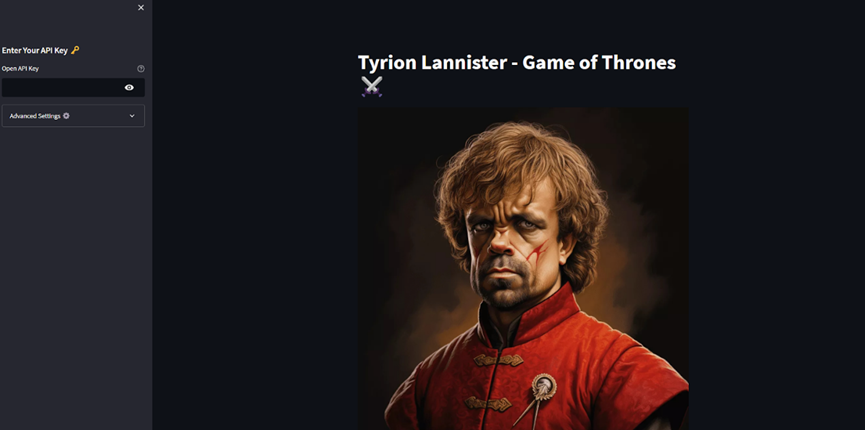
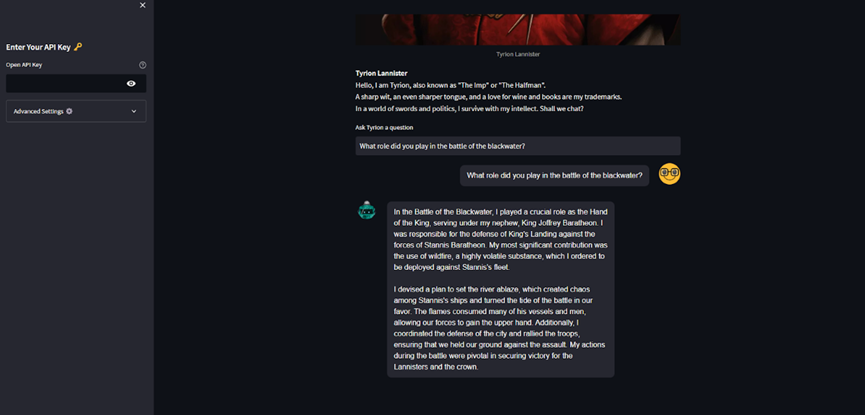
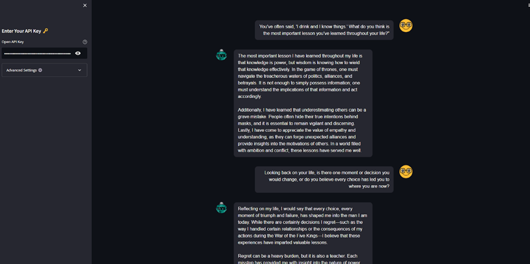
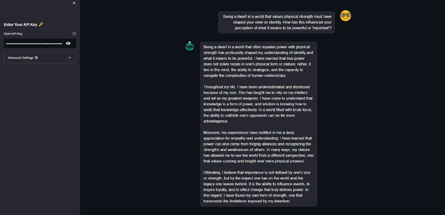

# Tyrion Lannister AI Agent

This project implements a Tyrion Lannister AI chatbot, designed to simulate the wit and wisdom of the iconic "Game of Thrones" character. It utilizes OpenAI's language models, Pinecone vector database, and LangChain to provide a rich and interactive conversational experience.

View the demo link: https://tyrion-lannister.streamlit.app/
---

## Features

- **Conversational AI**: Interact with Tyrion Lannister and receive witty, contextually rich responses.
- **Custom Knowledge Base**: Powered by a Pinecone vector index, built from "Game of Thrones" book data.
- **Streamlit UI**: A simple and intuitive web interface for user interaction.
- **Personalized Chat Context**: Maintains conversational history for dynamic and relevant answers.
- **Easy Deployment**: Integrates seamlessly with OpenAI and Pinecone services.

---

## Project Structure

```
Tyrion-Lannister-AI/
├── build_pinecone_index.py   # Script to create Pinecone index from book data
├── streamlit_app.py          # Streamlit app for chatbot interaction
├── data/
│   └── got-books/            # Folder containing "Game of Thrones" book text files
├── constants.py              # Configuration constants for models and settings
├── requirements.txt          # Python dependencies
└── README.md                 # Project documentation
```

---

## Setup Instructions

### Prerequisites

1. **Python 3.11 or higher**
2. **API Keys**:
   - [OpenAI API Key](https://openai.com/)
   - [Pinecone API Key](https://www.pinecone.io/)
3. **Libraries**:
   - Install required libraries listed in `requirements.txt`.

---

### Installation

1. Clone the repository:
    ```bash
    git clone https://github.com/your-username/Tyrion-Lannister-AI.git
    cd Tyrion-Lannister-AI
    ```

2. Create a virtual environment and activate it:
    ```bash
    python -m venv venv
    source venv/bin/activate  # On Windows: venv\Scripts\activate
    ```

3. Install dependencies:
    ```bash
    pip install -r requirements.txt
    ```

4. Set environment variables:
    - Create a `.env` file in the root directory:
      ```
      OPENAI_API_KEY=your_openai_api_key
      PINECONE_API_KEY=your_pinecone_api_key
      ```

---

### Index Creation

1. Place "Game of Thrones" book text files in the `data/got-books` directory.
2. Run the `build_pinecone_index.py` script to create the vector index:
    ```bash
    python build_pinecone_index.py
    ```

---

### Running the Chatbot

1. Launch the Streamlit app:
    ```bash
    streamlit run streamlit_app.py
    ```
2. Open the local server link provided by Streamlit in your browser.
3. Start chatting with Tyrion Lannister!

---

## Customization

### Chat Model
- The chatbot uses OpenAI's `gpt-4` model by default. You can change this in the Streamlit app's sidebar under "Advanced Settings".

### Vector Index
- Update the Pinecone index with additional book data to enhance Tyrion's knowledge.

---

## Example Conversation









## Technologies Used

- **Python**: Core language for development
- **LangChain**: For LLM integrations
- **Pinecone**: Vector database for storing embeddings
- **Streamlit**: Web application framework
- **OpenAI**: GPT model for generating responses

---

## Future Enhancements

- Add voice-based interaction for a more immersive experience.

---

## License

This project is licensed under the MIT License. See `LICENSE` for more details.

---

## Resources:

- [OpenAI](https://openai.com/) for providing GPT models.
- [Pinecone](https://www.pinecone.io/) for vector database services.
- George R.R. Martin for creating the rich world of Westeros.
- Kaggle: https://www.kaggle.com/datasets/khulasasndh/game-of-thrones-books

